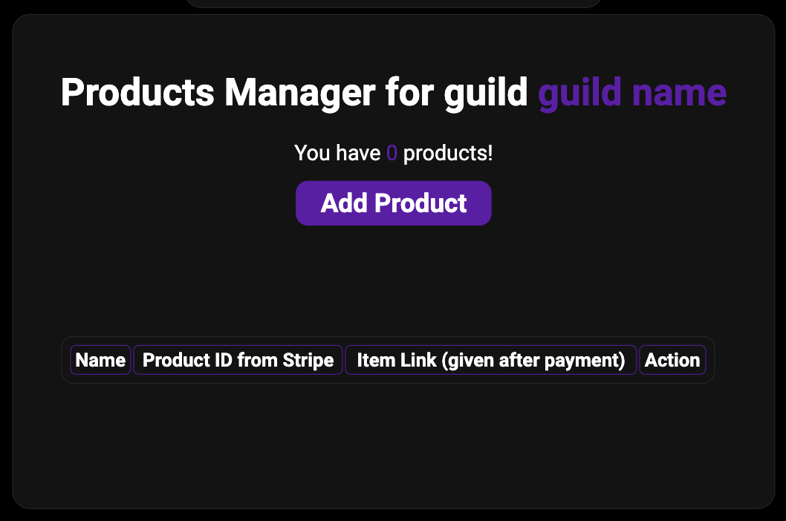
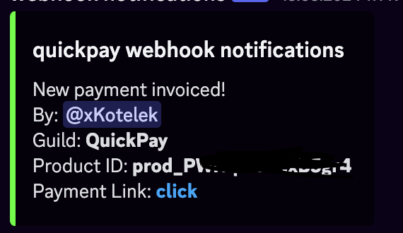

make a server-shop
=====

.. _quickstart:

Quick Start
------------

To use quickpay, you first have to login and add bot to your server

To do that go to 
`quickpay homapage <https://quickpay.kotelek.dev>`_ and click the "Login" button. It will redirect you to discord oauth2 page. 
Next you have to pick the server you want to make a server-shop in. When you choose click on it and click "Continue" and go back
to `dashboard <https://quickpay.kotelek.dev/dash>`_, click on the guild that you added bot to and hit "Subscribe" button.

.. image:: subscribe.png

Connecting with Stripe API
--------------------------

To make ``/buy`` command work you have to connect **quickpay** with your Stripe account via **API Key**. To do this you have to go on dashboard and pick a guild. Next the first steps configuration will pop up

.. image:: apikeyenter.png

You have to gather the API Key from `Stripe dashboard <https://dashboard.stripe.com/apikeys>`_, paste it and hit "Submit". Now you will be redirected to main guild/server management page:

In this menu you can manage your server-shop. To add a Stripe product click "Manage Products" and then "Add Product"

In adding menu you will se some inputs:

-----------------------
Wich input is for what?
-----------------------

* Product Name - this is only for organization, it won't be shown anywhere
* Product ID (from Stripe) - you have to gather this ID by adding a product on Stripe, you can do this `there <https://dashboard.stripe.com/products>`_ then you have to click on the product and copy it's ID:

.. image:: stripeproduct.png

* Item Link (given after payment) - when someone issues the ``/buy`` command and finishes the payment the bot will give that url (or text) to the user

After filling up the information press "Submit" now your product will appear in ``/buy`` command:

Optional - Adding Discord Webhook Notifications
-----------------------------------------------

The webhhook notifications is optional feature and will allow you to get notified every time when:

* user creates payment with ``/buy`` command

* user finishes the checkout and receive the url

* user cancels payment or payment got timed out - this works only sometimes so there is no screenshot

Conclusion
----------

You can see that makin server-shop on Discord with **quickpay** is very easy. I will add more things that user can get for money on Discord and I am working hard on finishing **WebPayment Service** which will allow users to create Checkout Buttons with 2 lines of code! (not counting `<script>` element it's only one line!). You can check out how it look right now at :doc:`usageweb`
