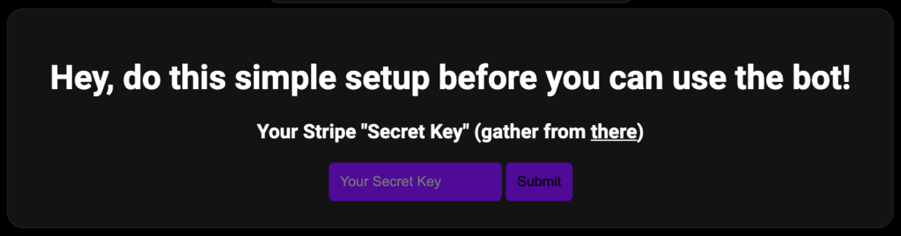

make a server-shop
=====

.. _quickstart:

Quick Start
------------

To use quickpay, you first have to login and add bot to your server

To do that go to 
`quickpay homapage <https://quickpay.kotelek.dev>`_ and click the "Login" button. It will redirect you to discord oauth2 page. 
Next you have to pick the server you want to make a server-shop in. When you choose click on it and click "Continue" and go back
to `dashboard <https://quickpay.kotelek.dev/dash>`_, click on the guild that you added bot to and hit "Subscribe" button.

.. image:: subscribe.png

Connecting with Stripe API
--------------------------

To make ``/buy`` command work you have to connect **quickpay** with your Stripe account via **API Key**. To do this you have to go on dashboard and pick a guild. Next the first steps configuration will pop up

