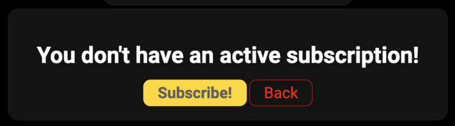
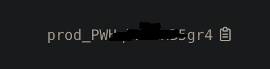

Set up webpayments
==================

===========
Quick Start
===========

To use quickpay webpayments you have to go to `webpayments dashboard <https://quickpay.kotelek.dev/dash/web>`_ and add a website.

-----------------------
Which input is for what
-----------------------

* domain - this is only for organization, you can type anything you want here
* stripe api key - you have to create one on `this page <https://dashboard.stripe.com/apikeys>`_ using this button:

You can name this Secret Key using random name it's not very important. After creating click on it's value and it will be automatically copied into your clipboard

* stripe publishale key - this key is on the same page but it's created automatically you have to click on it's value and it will be automatically copied into your clipboard
* success payment redirect url - to this url user will be redirected after finishing the payment inside the checkout-box.

Subscribing
-----------

When you will click "Manage" on Checkout Buttons section or click edit/remove you will se that page:

When you will finish payment you have to go back to `webpayments dashboard <https://quickpay.kotelek.dev/dash/web>`_ and you will see this box:

Click "Manage" on Checkout Buttons section to implement webpayments to your website.

Click "Add Button" and this is the menu you will see:

Stripe Product ID is the product id from `Stripe Product Catalog <https://dashboard.stripe.com/products>`_. Click on this and you will get the ID in your clipboard.

After clicking submit go back to Checkout Buttons Manager and near your button click "Implement" you will get the HTML code inside your clipboard. After pasting the code inside your website you will se the button. Example website is `here <https://quickpay.kotelek.dev/webpay-example>`_. After pressing the button Stripe's Checkout Frame will appear and you can finish the payment.

Conclusion
----------

Making Website Shop is even easier with quickpay. I will soon add a subscription for 2: 1 Discord guild and 1 website and it will be cheaper. Try quickpay now 7 days for free at `quickpay.kotelek.dev <https://quickpay.kotelek.dev/>`_ I will add info about webpayments soon there.
